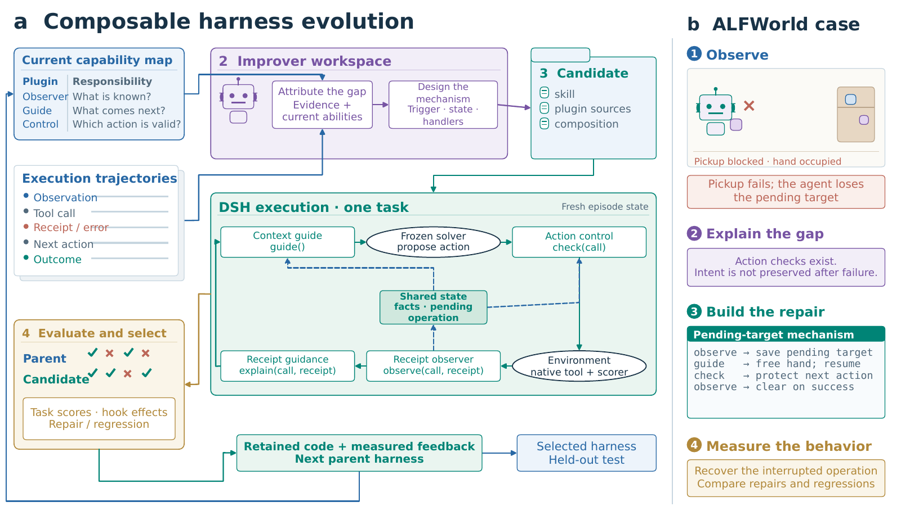
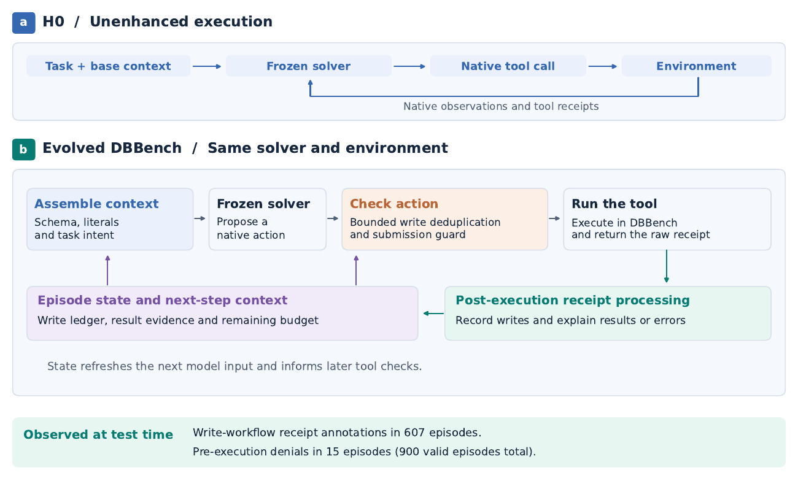
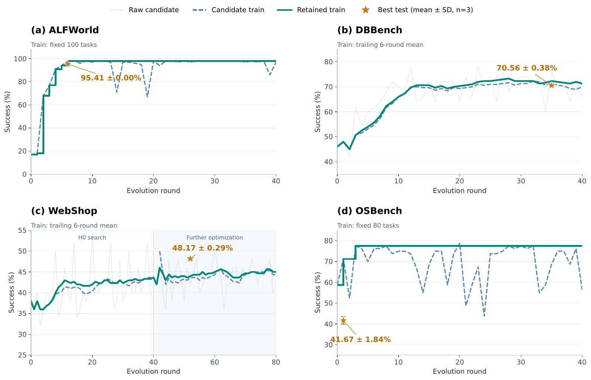

# DSH Harness Evolution

**How much can a frozen agent improve by evolving its harness?**

We study how improver capability and editable scope shape the harnesses discovered from execution feedback. A frozen Qwen3-4B executor solves tasks; a separate improver updates the plugins around it on **DeepSeek Harness**.

[Project page](https://huangshengzebluesky.github.io/dsh-harness-evolution/?lang=en) · [Results](LEADERBOARD.md) · [Reproduce](docs/REPRODUCING.md) · [Artifacts](harnesses/) · [简体中文](README.zh-CN.md)

## Current research snapshot · 2026-11-13

Synced from the current Overleaf manuscript: four-benchmark results, 36 model–scope profiles, completed C evaluations, artifact source code, figures and reproduction materials. Headline results are measured peaks; historical five-benchmark results and development-selected outputs remain available.

[Manuscript and appendices](paper/manuscript/) · [Research status and data](paper/STATUS.md) · [Configurations and provenance](paper/manuscript/dsh-draft/reproducibility/experiment-index.json)

## Method

**Observe and attribute → propose a candidate → evaluate and select → retain feedback.**

The loop reads the current harness and its execution traces, proposes a reusable repair, and compares it with its parent. DSH supplies the execution loop, plugin lifecycle, prompt assembly, tool hooks and episode state.

**L4** is the historical capability-guided search recipe. It describes the current agent's abilities and plugin responsibilities before proposing code edits. **A/B/C** controls which edits the improver may make within a shared search procedure.

| Scope | Editable surface |
|---|---|
| A | Skill text |
| B | One independent component per round: skill, memory, action checking or receipt interpretation |
| C | Skill or coordinated mechanisms sharing episode-local state across hooks |

[L4 implementation](evolution/src/dsh_evolve/loops/l4.py) · [A/B/C controller](evolution/src/dsh_evolve/abc.py) · [Recorded configurations](configs/)

## What evolves?

The released **DBBench L4 harness reaches 70.56% test success**. Its write workflow records database receipts in episode state. Later context exposes that state to the solver, while action checks use it to handle repeated writes and premature submission. Other plugins provide schema grounding, result handling and recovery.

[Inspect the harness](harnesses/dbbench/20261026-l4-h0-sol61-v35/) · [Runtime protocol](harnesses/dbbench/20261026-l4-h0-sol61-v35/protocol.json) · [Recorded evaluation](harnesses/dbbench/20261026-l4-h0-sol61-v35/evaluation.json)

## Results and evolution

<!-- paper-table:start -->
| Benchmark | Current manuscript measured peak |
|---|---:|
| ALFWorld | 95.41 ± 0.00% |
| DBBench | 70.56 ± 0.38% |
| WebShop | 48.17 ± 0.29% |
| OSBench | 41.67 ± 1.84% |
<!-- paper-table:end -->

Current manuscript settings and checkpoint selection

The table and evolution figure follow the 2026-11-13 Overleaf manuscript. Headline values are highest measured test checkpoints with sample standard deviations across executions. The [experiment index](paper/manuscript/dsh-draft/reproducibility/experiment-index.json) preserves their lineages, training configurations and test records. The current OSBench headline is C-sol61-narrow v01 at 41.67%.

The [historical five-benchmark table](paper/data/main-results-20261111.json) and [development-selected controlled outputs](paper/data/controlled-abc.json) remain separate. See the [current 36 model–scope profiles](paper/data/scope-profiles-20261113.json) for the updated comparison.

## Historical experiment collection

| Question | Evidence |
|---|---|
| What changes across improvers and reasoning effort? | [Eight C configurations per benchmark](paper/README.md#多配置进化曲线) |
| What changes across editable scopes? | [Nine-panel model × scope plots](https://huangshengzebluesky.github.io/dsh-harness-evolution/?lang=en#curves) and [matched A/B/C records](paper/data/controlled-abc.json) |
| What changes with training data? | [C data-control configurations](configs/abc/) and their measured outcomes |
| How do training gains relate to held-out performance? | [Evolution and late-regression figures](paper/README.md) |

The four-benchmark collection contains **68 curve panels**, with measured test points, uncertainty where available, and configuration identities. [All 28 figures](paper/README.md) · [Numeric trajectories](paper/data/trajectories.json).

## Quick start

Prepare the benchmark assets and model access described in the [environment guide](docs/REPRODUCING.md), then run:

~~~bash
python -m pip install -e evolution
dsh-evolve init ./runs/db-c --profile abc/dbbench/C-sol61 --assets /data/dbbench
dsh-evolve setup ./runs/db-c/experiment.yaml
dsh-evolve run ./runs/db-c/experiment.yaml
~~~

- **Historical L4 search** — select a profile from [configs/l4](configs/l4/).
- **Controlled A/B/C search** — select a profile from [configs/abc](configs/abc/).
- **Frozen-artifact evaluation** — load a [released harness](harnesses/) with the matching [evaluation protocol](docs/REPRODUCING.md#frozen-artifacts).

The [installation check](evolution/scripts/smoke.py) exercises the runtime on a synthetic task without paid model calls.

## Code and data

| Directory | Contents |
|---|---|
| [evolution](evolution/) | Shared runtime, L4 recipe and A/B/C controller |
| [configs](configs/) | Exact task schedules, model settings and starting compositions |
| [harnesses](harnesses/) | Five-benchmark artifacts, diagrams, protocols and measurements |
| [paper](paper/) | Figures, tables and numeric experiment records |

[Software citation](CITATION.cff) · [Publishing results](docs/PUBLISHING.md) · [MIT license](LICENSE)

Built on [DeepSeek Harness](https://github.com/deepseek-ai/deepseek-harness). Benchmark and dependency credits are listed in [Third-party notices](docs/THIRD_PARTY.md).
